# Diagrams

Visual quick-start for moskills. Each diagram has an editable source
(`.mmd`, Mermaid) and rendered images (`.svg` for docs, `.png` for slides or
chat).

## moskills workflow

The whole flow on one line: where each command sits, and where an evolvebook
slots in.

## Evolvebook anatomy

What one evolvebook is made of, read left to right as a loop: what past runs
wrote feeds what the next run reads. Dotted arrows are how the book grows,
always with your yes.

## Evolvebook lifecycle

One run mapped onto the moskills flow. Blue: moskills commands. Green: the
seven evolvebook steps.

## Updating a diagram

1. Edit the `.mmd` file. The evolvebook diagrams are also inlined in
   [../evolvebook.md](../evolvebook.md): keep both identical (the test suite
   checks it).
2. Re-render: `sh docs/diagrams/render.sh` (needs Node; set
   `PUPPETEER_EXECUTABLE_PATH` to use an installed Chromium).
3. Commit the `.mmd`, `.svg` and `.png` together.
