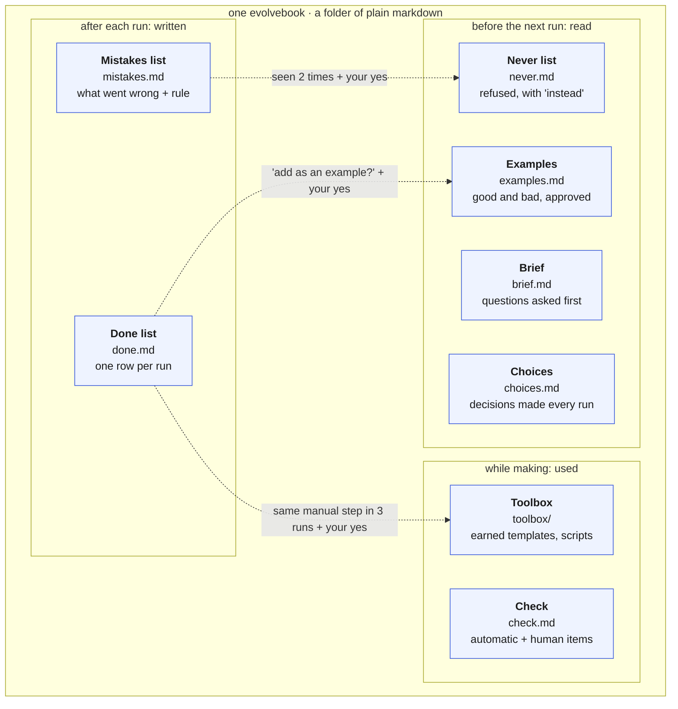
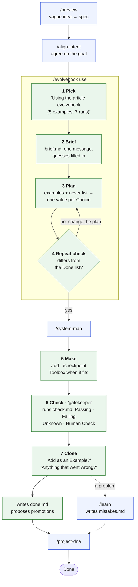

# Evolvebook

> An evolvebook is a guide for one kind of job. It remembers what good looks
> like, what we already made, and what went wrong, so every run is better than
> the last.

moskills says *how we work on any task* (align, build, check, hand off). An
evolvebook says *how we do one specific job well*: a dev article, a landing
page, a NestJS module. You write it once, in three short answers; it improves
every time it is used.

## Anatomy

What one evolvebook is made of, read left to right as a loop: what past runs
wrote feeds what the next run reads. Dotted arrows are how the book grows,
always with your yes.



Where things live:

| Layer | Location | Holds |
|---|---|---|
| Method | moskills: the `/evolvebook` skill and its helper | How to create, use, grow, list, link, export |
| Home | `~/.evolvebooks/`, an Obsidian vault folder, or any folder | Your personal books, `EVOLVEBOOKS.md` index, `shared/brand.md` |
| Project | `<repo>/.evolvebooks/` | Team books, versioned with the repo; they win over a personal book with the same name |

```text
<home>/
├── EVOLVEBOOKS.md          # index, one line per book (rebuilt automatically)
├── shared/brand.md         # optional: voice, palette, fonts
└── article/                # one evolvebook
    ├── SKILL.md            # when to use it + the run steps (any agent can follow)
    ├── brief.md  examples.md  choices.md  never.md  check.md
    ├── done.md   mistakes.md
    └── toolbox/            # starts empty, earned by repetition
```

## Lifecycle

How a run fits in the moskills flow. Blue boxes are the moskills commands you
already use; green boxes are the seven evolvebook steps slotted between them,
with the book file each step reads or writes.



Growing needs no command: say "add this as a good example" or "never do X
again" at any time.

## Commands

| Command | Does |
|---|---|
| `/evolvebook` or `/evolvebook list` | Show every book: examples, runs, last used, where |
| `/evolvebook setup` | Choose the Home (asked automatically the first time) |
| `/evolvebook new <job>` | Create a book: one message, three short answers, one summary, "ok" |
| `/evolvebook use <job>` | Run with a book. Usually automatic: the agent picks the matching book |
| `/evolvebook link` | Make your books available in Claude Code, Codex and Antigravity |
| `/evolvebook export <job>` | One markdown file to upload in ChatGPT or Claude web |

Terminal (after the one-line install): `moskills evolvebook <command>` runs the
helper directly, for example `moskills evolvebook list`.

## Configure the Home

The Home is looked up, never hardcoded. The first one found wins:

1. `EVOLVEBOOKS_HOME` environment variable
2. the nearest `.evolvebooks.json` walking up from the current folder: `{ "home": "<path>" }` (a relative path is relative to that file)
3. the user config `~/.config/evolvebooks/config.json`, written by setup
4. `~/.evolvebooks/`, when it exists

`/evolvebook setup` (or `moskills evolvebook setup` in a terminal) asks one
question: default folder, a folder in your Obsidian vault, any other folder, or
only inside projects. `moskills doctor` and `moskills status` show the result;
`moskills init` tells you when it is not configured yet.

## What the helper guarantees

The agent does the judgement (questions, examples, rules). Everything that
must give the same answer every time is done by
`templates/claude/skills/evolvebook/scripts/evolvebook.sh`:

| Helper command | Guarantee |
|---|---|
| `repeat <book> k=v ...` | A plan must name every Choice; it must differ from every past run on at least half of them (or `Repeat threshold: N`) |
| `record <book> "<what>" k=v ... --steps "a; b"` | One Done row per run, today's date, index rebuilt |
| `suggest <book>` | Mistakes at `Seen: 2` and manual steps seen in 3 runs, never already promoted ones |
| `example` / `never` / `mistake <book> ...` | Exact entry formats; a Never rule always has an Instead; a repeated Mistake raises `Seen`; secrets refused |
| `scan <file>` | Refuses keys, tokens, private keys and IBAN-like values, without printing them |
| `link` / `unlink` | Symlinks only; never replaces a folder it did not create |
| `export <book>` | One self-contained file; refused if it contains a secret |

## Safety

- Agents read and write only inside the Home and the project `.evolvebooks/`.
  A Home inside an Obsidian vault keeps the rest of the vault off-limits.
- Nothing enters Examples, the Never list or the Toolbox without your yes.
- Examples never hold secrets or personal data: the helper scans them.

## Works in

| Agent | How |
|---|---|
| Claude Code | Full: automatic pick, session-start line, write-back, suggestions |
| Codex, Antigravity, other `SKILL.md` agents | `/evolvebook link` (or `moskills evolvebook link`); awareness from `AGENTS.md` |
| ChatGPT, Claude web | `/evolvebook export <job>`, upload as project knowledge, paste results back |
